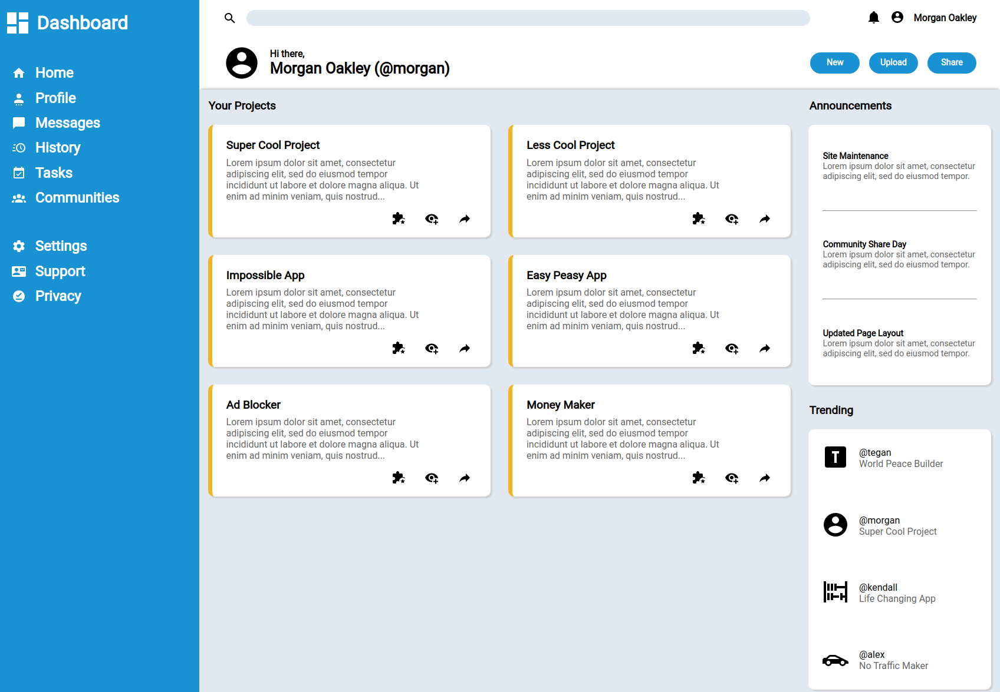
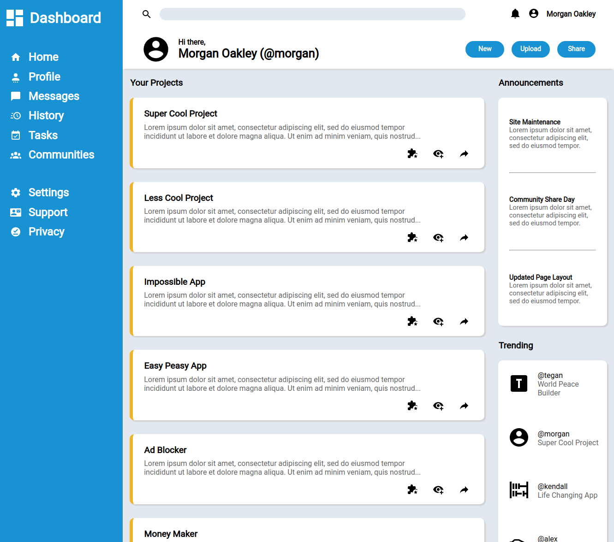
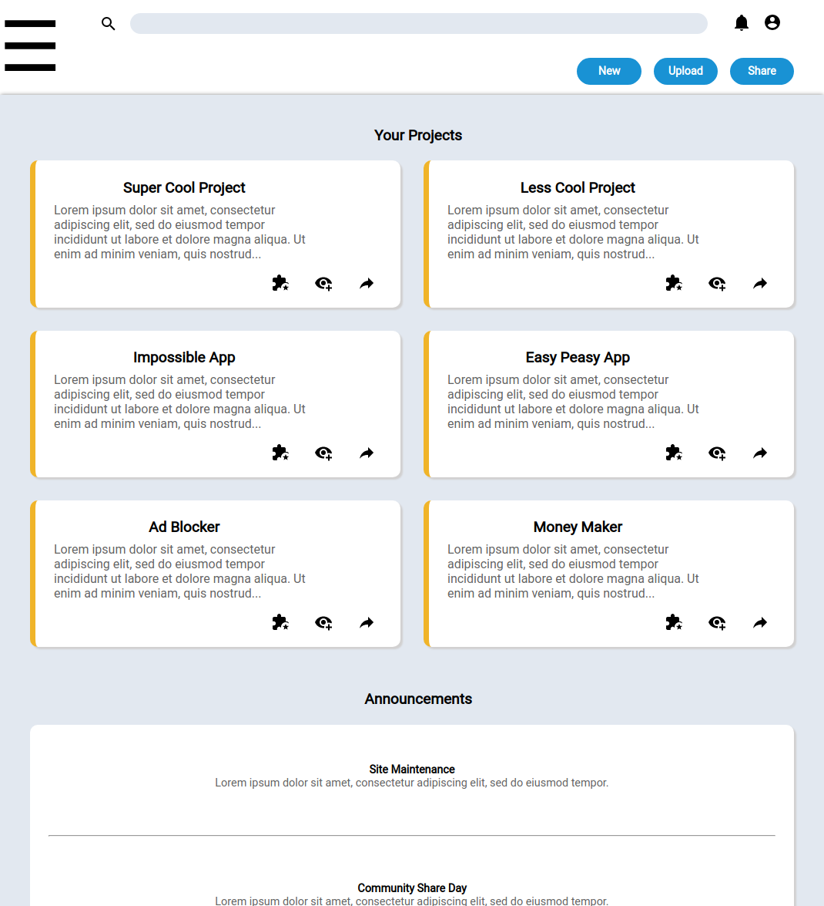
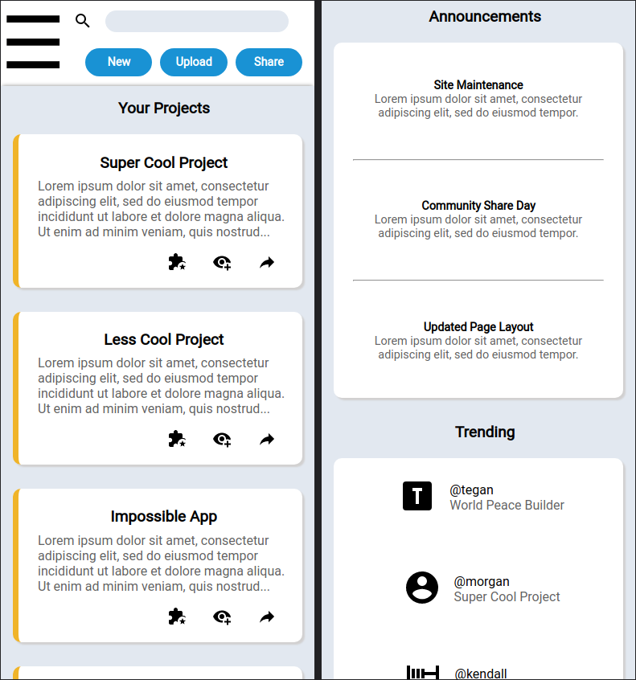

# Odin Project #7: Admin Dashboard

The goal of this Odin Project assignment was to create an admin dashboard page. Emphasis on Grid.

I started and finished this project in August 2022.

## Assignment

[The Odin Project - Intermediate HTML and CSS - #7 Admin Dashboard](https://www.theodinproject.com/lessons/node-path-intermediate-html-and-css-admin-dashboard)

## Technology

- HTML
- CSS
- Vanilla JavaScript

## Key Concepts

- HTML and CSS styling
- Grid: grid-template-columns/rows, repeat, minmax

## Features

- Hamburger menu for tablet & mobile

## Links

[Live Demo](https://bn7631-odin-admin-dashboard.pages.dev)

## Screenshots

### Desktop





### Tablet



### Mobile



## Sources for fonts and icons

- https://materialdesignicons.com/
- https://fonts.google.com/specimen/Roboto

## Deployment

```bash
  git clone https://github.com/BrightNeon7631/odin-admin-dashboard.git
```
